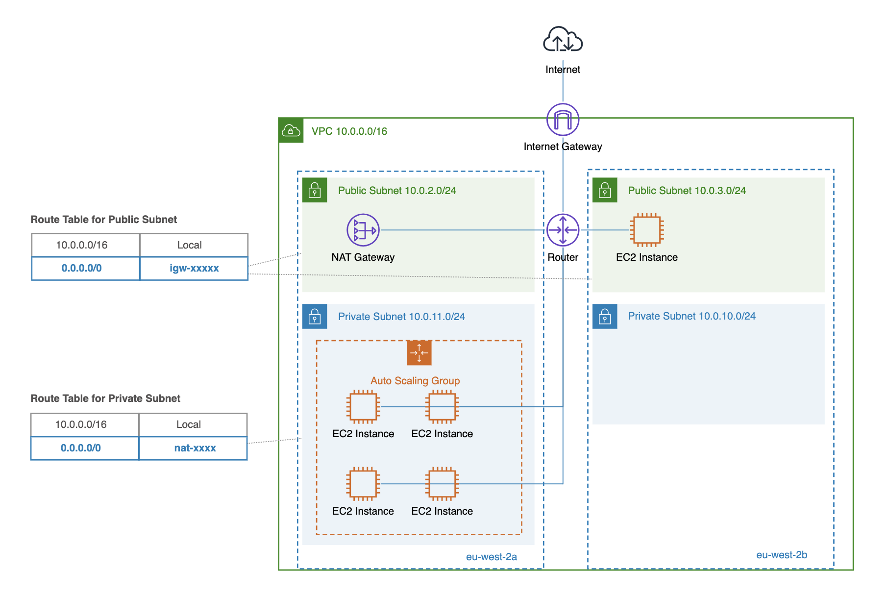
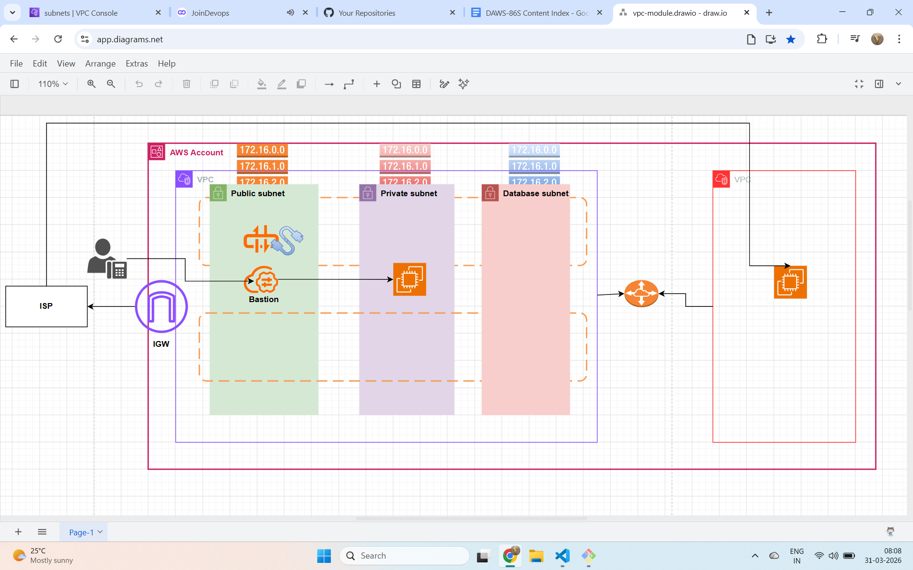

# AWS EC2 Security Groups & VPC Creation – Practical Guide

This README explains **which ports should be opened** for **EC2 Security Groups (Inbound & Outbound)** and how to **create a VPC correctly**, with **clear real‑world examples**.

---

## 1. What is a Security Group?
A **Security Group (SG)** is a **stateful virtual firewall** attached to AWS resources like EC2.

Key points:
- Works at **instance level**
- **Stateful** (return traffic is automatically allowed)
- Rules are **ALLOW only** (no DENY rules)

---

## 2. Inbound vs Outbound Rules (Simple)

| Direction | Meaning |
|---------|--------|
| Inbound | Traffic **coming INTO** the EC2 instance |
| Outbound | Traffic **going OUT FROM** the EC2 instance |

---

## 3. Recommended Inbound Ports for EC2 (Common Scenarios)

### 🔐 SSH Access (Linux EC2)
```
Type     : SSH
Protocol : TCP
Port     : 22
Source   : <YOUR_PUBLIC_IP>/32
```

⚠️ Avoid `0.0.0.0/0` in production.

---

### 🌐 Web Server (HTTP / HTTPS)
```
HTTP  | TCP | 80  | 0.0.0.0/0
HTTPS | TCP | 443 | 0.0.0.0/0
```

Used for:
- Nginx
- Apache
- Load-balanced applications

---

### 🗄️ Database Access (Example: MySQL)
```
MySQL | TCP | 3306 | Source: sg-<APP-SERVER-SG>
```

✔ Allows DB access **only from app servers**
❌ Never expose databases to the internet

---

## 4. Outbound Rules (Important but Simple)

### ✅ Default (Recommended)
```
All traffic | All | 0.0.0.0/0
```

Why?
- OS updates
- Package downloads
- External APIs
- Docker image pulls

⚠️ Since SGs are **stateful**, return traffic is automatically allowed.

---

## 5. Example: Secure EC2 Security Group (Production)

### Inbound Rules
```
SSH     22     <ADMIN_IP>/32
HTTP    80     0.0.0.0/0
HTTPS   443    0.0.0.0/0
```

### Outbound Rules
```
All traffic   All   0.0.0.0/0
```

---

## 6. Security Group Source Types (CRITICAL CONCEPT)

| Source Value | Meaning |
|-------------|--------|
| `0.0.0.0/0` | Anyone on the internet |
| `<IP>/32` | Single trusted machine |
| `sg-xxxx` | Traffic from another AWS resource |

### Example:
```
Allow 3306 from sg-app-servers
```
Means:
> Only EC2s with **sg-app-servers** can access DB

---

## 7. What is a VPC?
A **VPC (Virtual Private Cloud)** is your **isolated network** in AWS.

It contains:
- Subnets
- Route Tables
- Internet Gateway
- NAT Gateway
- Security Groups
- NACLs
---

Pic:



---

## 8. Standard VPC Creation (Public EC2 Setup)

### Step 1: Create VPC
```
CIDR: 10.0.0.0/16
```

---

### Step 2: Create Public Subnet
```
Subnet CIDR: 10.0.1.0/24
```
Enable:
```
Auto-assign Public IPv4: YES
```

---

### Step 3: Create Internet Gateway (IGW)
- Create IGW
- Attach to VPC

---

### Step 4: Route Table (Public)
Add route:
```
0.0.0.0/0  →  Internet Gateway
```

Associate this route table with **public subnet**.

---

## 9. Minimal Network ACL (Recommended)

### Inbound
```
ALLOW ALL | 0.0.0.0/0
```

### Outbound
```
ALLOW ALL | 0.0.0.0/0
```

✔ Keep NACL simple
✔ Control access using **Security Groups**

---

Pic:


## 10. Common Mistakes (VERY IMPORTANT)

``` text
❌ Allowing SSH from **Security Group instead of IP**

❌ No public IP on EC2

❌ Subnet without IGW route

❌ Blocking ephemeral ports in NACL

❌ Opening DB ports to internet
```
---

## 11. Golden Rules (Remember This)
``` text 
1️⃣ Route Table + IGW ≠ Internet access

2️⃣ Public IP + Correct SG = Access

3️⃣ SG is **stateful**, NACL is **stateless**

4️⃣ Ports don’t matter if **SOURCE is wrong**

```
---

## 12. Quick Interview Answer

> "I ensure EC2 SSH is restricted to my IP, web ports are public, databases accept traffic only from application security groups, outbound is open, and networking is handled via public subnets with IGW."

---


##  Terraform AWS VPC

This module creates the following resources.
# 🏗️ VPC Infrastructure Terraform Module

## Overview

This Terraform module provisions a complete Virtual Private Cloud (VPC) network setup with public, private, and database subnets across two Availability Zones in **us-east-1**. It also configures internet access, NAT gateway routing, and VPC-to-default VPC peering.

---

## 🚀 Resources Created

### **VPC**
- Creates an isolated **Virtual Private Cloud (VPC)** as the main networking boundary.
- DNS hostnames are enabled for instances to get public DNS names.
- Tagged dynamically with environment, project name, and common tags.

---

### **Internet Gateway (IGW)**
- Attaches to the VPC to allow inbound/outbound traffic between the VPC and the Internet.
- Required for public subnets to have internet access.

---

### **Subnets**
| Type | Purpose | Availability Zones | Description |
|------|----------|--------------------|--------------|
| Public | Internet-facing layer | `us-east-1a`, `us-east-1b` | Hosts public resources like load balancers or bastion hosts. |
| Private | Application layer | `us-east-1a`, `us-east-1b` | Hosts internal EC2 instances not accessible from the Internet. |
| Database | Data layer | `us-east-1a`, `us-east-1b` | Hosts databases (e.g., RDS) that are isolated from direct public access. |

Each subnet:
- Uses CIDR blocks passed through variables (`public_subnet_cidrs`, `private_subnet_cidrs`, `database_subnet_cidrs`).
- Is distributed across AZs for **high availability**.
- Is automatically tagged with environment and zone information.

---

### **Route Tables**
| Route Table | Purpose | Default Route |
|--------------|----------|----------------|
| Public | Handles routing for public subnets | `0.0.0.0/0 → IGW` |
| Private | Handles routing for private subnets | `0.0.0.0/0 → NAT Gateway` |
| Database | Handles routing for database subnets | `0.0.0.0/0 → NAT Gateway` (for patching/updates only) |

Each route table is tagged and associated with the corresponding subnets.

---

### **Elastic IP (EIP)**
- Allocates a **static public IP** for the NAT Gateway.
- Ensures consistent outbound IP address for private/database resources.

---

### **NAT Gateway**
- Deployed in the **public subnet (us-east-1a)**.
- Enables instances in **private** and **database** subnets to **access the internet** (e.g., for OS updates) **without being reachable from the internet**.
- Depends on the Internet Gateway creation.

---

### **Routing Setup**
- **Public Route Table**: Directs `0.0.0.0/0` to the **Internet Gateway**.
- **Private Route Table**: Directs `0.0.0.0/0` to the **NAT Gateway**.
- **Database Route Table**: Also routes `0.0.0.0/0` via the **NAT Gateway**.
- **Route Table Associations**: Each subnet is linked to the correct route table automatically.

---

### **VPC Peering (Optional )**

    - The module supports adding **VPC peering** between this custom VPC and the **default VPC**.

    - Routes are added on both sides to enable private communication between the two VPCs.

Pic:



---

## 🌐 **Network Flow Summary**

| Subnet Type | Internet Access | Route Through | Publicly Accessible |
|--------------|----------------|----------------|---------------------|
| Public | Yes (Inbound + Outbound) | Internet Gateway | ✅ Yes |
| Private | Outbound Only | NAT Gateway | ❌ No |
| Database | Outbound Only (for patching) | NAT Gateway | ❌ No |

---

## 🧭 **High-Level Architecture**

               +-------------------------+
               |       Internet          |
               +-----------+-------------+
                           |
                       [ IGW ]
                           |
      +-----------------------------------------+
      |                 VPC                    |
      |  CIDR: 10.0.0.0/16                     |
      |                                         |
      |  +-------------+       +-------------+  |
      |  | Public Sub  |       | Public Sub  |  |
      |  | us-east-1a  |       | us-east-1b  |  |
      |  | EC2, LB, etc|       | EC2, LB, etc|  |
      |  +------▲------+       +------+-------+  |
      |         | NAT GW (EIP)        |          |
      |         +---------------------+          |
      |                                         |
      |  +-------------+       +-------------+  |
      |  | Private Sub |       | Private Sub |  |
      |  | us-east-1a  |       | us-east-1b  |  |
      |  | App Servers |       | App Servers |  |
      |  +-------------+       +-------------+  |
      |                                         |
      |  +-------------+       +-------------+  |
      |  | DB Subnet   |       | DB Subnet   |  |
      |  | us-east-1a  |       | us-east-1b  |  |
      |  | RDS, DB     |       | RDS, DB     |  |
      |  +-------------+       +-------------+  |
      |                                         |
      +-----------------------------------------+
                           |
                     [ VPC Peering ]
                           |
                  +--------------------+
                  |   Default VPC      |
                  +--------------------+


### Inputs


---

## ⚙️ **Inputs**

| Variable | Description | Example |
|-----------|--------------|----------|
| `vpc_cidr` | CIDR block for the VPC | `"10.0.0.0/16"` |
| `public_subnet_cidrs` | List of CIDRs for public subnets | `["10.0.1.0/24", "10.0.2.0/24"]` |
| `private_subnet_cidrs` | List of CIDRs for private subnets | `["10.0.3.0/24", "10.0.4.0/24"]` |
| `database_subnet_cidrs` | List of CIDRs for DB subnets | `["10.0.5.0/24", "10.0.6.0/24"]` |
| `az_names` | List of Availability Zones | `["us-east-1a", "us-east-1b"]` |
| `vpc_tags`, `igw_tags`, `subnet_tags`, etc. | Custom tags for each resource type | `{ Environment = "dev" }` |

---

## 🧩 **Outputs**

| Output | Description |
|---------|--------------|
| `vpc_id` | The ID of the created VPC |
| `public_subnet_ids` | List of public subnet IDs |
| `private_subnet_ids` | List of private subnet IDs |
| `database_subnet_ids` | List of database subnet IDs |
| `nat_gateway_id` | ID of the created NAT Gateway |
| `internet_gateway_id` | ID of the Internet Gateway |

---

